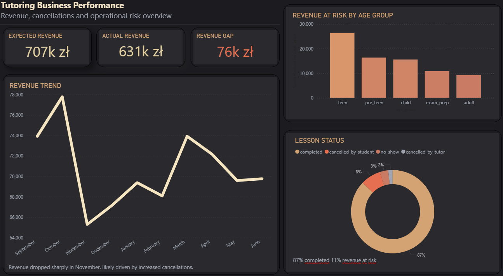

# Tutoring Business Revenue and Risk Analysis
Power BI | SQL | Python | Data Analysis 

---

## Dashboard Preview



---

## Overview

This project analyses the performance of a tutoring business, focusing on revenue, cancellations, and operational risk.

The objective of the analysis was to:

- compare expected vs actual revenue
- identify key drivers of revenue loss
- analyse the impact of cancellations and no-shows
- understand how revenue risk varies across student groups

The project was completed as an end-to-end data analysis workflow using Python, SQL, and Power BI.

This project was designed to simulate a real-world business scenario and demonstrate an end-to-end analytical workflow.

---

## Business Context

Tutoring businesses rely on scheduled lessons, but actual revenue is often affected by cancellations, no-shows, and payment behaviour.

Understanding these factors is critical for:

- improving revenue predictability
- reducing financial losses
- identifying high-risk customer segments
- improving operational decision-making

This project simulates a real-world tutoring business scenario to demonstrate how data can be used to analyse business performance.

---


## Project Background

This project is based on a real tutoring business context that I was personally involved in.

To ensure privacy and comply with data protection principles, all data used in this project was synthetically generated in Python to reflect realistic business scenarios without exposing any real personal or sensitive information.

The entire project was built independently end-to-end, including:

- designing the business scenario  
- generating the dataset in Python  
- analysing the data using SQL  
- building the final dashboard in Power BI  

The goal was to replicate a realistic business analysis workflow rather than working on a pre-existing dataset.

---

## Dataset

Source: simulated tutoring business dataset (Python-generated)

The dataset includes:

- lesson schedules
- student profiles (age groups, lesson types)
- tutor assignments
- lesson status (completed, cancelled, no-show)
- pricing and payments

A sample dataset is included in this repository.

---

## Tools & Technologies

- Python  
- Pandas  
- Faker  
- SQL  
- SQL Server (SSMS)  
- Power BI  

---

## Analysis Performed

The analysis focuses on four key areas:

### 1. Revenue Performance

The analysis compares:

- expected revenue (based on scheduled lessons)
- actual revenue (based on payments)

This allows identification of the revenue gap and potential financial leakage.

---

### 2. Lesson Disruption Analysis

Revenue loss is analysed based on:

- student cancellations
- tutor cancellations
- no-shows

This helps identify the main operational drivers of lost income.

---

### 3. Segment Analysis

Revenue risk is analysed across student groups.

The analysis shows that some segments contribute disproportionately to revenue loss.

---

### 4. Time-Based Trends

Revenue loss is analysed across months.

A noticeable drop in performance appears in certain periods, indicating operational instability.

---

## SQL Analysis

SQL was used to analyse the dataset and answer key business questions.

The analysis includes:

- revenue distribution by lesson status  
- revenue share (%) by status  
- revenue risk by age group  
- monthly revenue loss  
- expected vs actual revenue calculation  

---

## Dashboard

The Power BI dashboard presents:

- Expected Revenue  
- Actual Revenue  
- Revenue Gap  
- Revenue Trend  
- Revenue at Risk by Age Group  
- Lesson Status Distribution  

The dashboard is designed to support quick business interpretation and decision-making.

---

## Key Business Insights

There is a clear gap between expected and actual revenue, primarily driven by cancellations and no-shows rather than pricing issues.

Student cancellations and no-shows represent the largest source of revenue loss, with the highest impact observed in evening time slots where demand is strongest.

Revenue risk is concentrated in specific segments, particularly among adult learners and exam preparation students, who show less consistent attendance patterns.

Revenue performance varies across the academic year, with noticeable declines during winter months, suggesting seasonal impact on attendance behaviour.

These patterns indicate that operational factors such as scheduling, availability, and attendance behaviour play a bigger role in revenue performance than pricing alone.

---


## Business Recommendations

Based on the analysis, the business could consider:

- introducing stricter cancellation policies for high-risk segments
- offering more flexible rescheduling options during winter periods
- prioritising high-demand evening slots for more reliable students
- monitoring tutor availability to reduce scheduling bottlenecks

---


## Repository Structure

```
tutoring-business-revenue-and-risk-analysis
│
├── sample_lessons_data.csv
│
├── notebooks
│   ├── 01_project_setup.ipynb
│   └── 02_generate_tutors_clean.ipynb
│
├── screenshots
│   └── powerbi-tutoring-business-revenue-dashboard.png
│
├── sql
│   ├── lesson_status_revenue.sql
│   ├── revenue_share_by_status.sql
│   ├── revenue_risk_by_age_group.sql
│   ├── monthly_revenue_loss.sql
│   └── revenue_kpi_calculation.sql
│
├── Tutoring_Business_Performance_Dashboard.pbix
└── README.md
```

---

## Project Files

- `Tutoring_Business_Performance_Dashboard.pbix` – Power BI dashboard  
- `powerbi-tutoring-business-revenue-dashboard.png` – dashboard preview  
- `sample_lessons_data.csv` – sample dataset  
- notebooks – Python data generation  
- sql – SQL analysis queries  

---

## About This Project

This project forms part of my data analytics portfolio and demonstrates an end-to-end approach:

- generating data in Python  
- analysing data in SQL  
- presenting insights in Power BI  

The focus is on business understanding, not just visualisation.

---


## Kaggle Dataset
This dataset is also available on Kaggle:
[(https://www.kaggle.com/datasets/dziduszka/tutoring-business-revenue-risk-dataset)]
